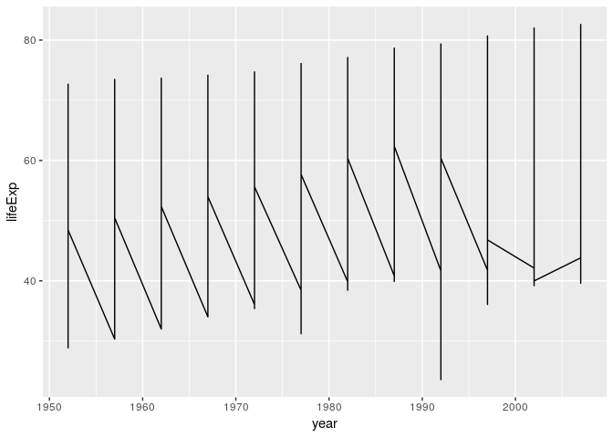

cm008 Exercises
================

``` r
suppressPackageStartupMessages(library(tidyverse))
```

    ## Warning: replacing previous import by 'tibble::as_tibble' when loading
    ## 'broom'

    ## Warning: replacing previous import by 'tibble::tibble' when loading 'broom'

``` r
suppressPackageStartupMessages(library(gapminder))
```

`mutate()`
----------

Let's get:

-   GDP by multiplying GPD per capita with population, and
-   GDP in billions, named (`gdpBill`), rounded to two decimals.

``` r
gapminder %>% 
  mutate(gdp = gdpPercap * pop, 
         gdpBill = round(gdp/1e9, 2))
```

    ## # A tibble: 1,704 x 8
    ##    country    continent  year lifeExp     pop gdpPercap        gdp gdpBill
    ##    <fct>      <fct>     <int>   <dbl>   <int>     <dbl>      <dbl>   <dbl>
    ##  1 Afghanist… Asia       1952    28.8  8.43e6      779.    6.57e 9    6.57
    ##  2 Afghanist… Asia       1957    30.3  9.24e6      821.    7.59e 9    7.59
    ##  3 Afghanist… Asia       1962    32.0  1.03e7      853.    8.76e 9    8.76
    ##  4 Afghanist… Asia       1967    34.0  1.15e7      836.    9.65e 9    9.65
    ##  5 Afghanist… Asia       1972    36.1  1.31e7      740.    9.68e 9    9.68
    ##  6 Afghanist… Asia       1977    38.4  1.49e7      786.    1.17e10   11.7 
    ##  7 Afghanist… Asia       1982    39.9  1.29e7      978.    1.26e10   12.6 
    ##  8 Afghanist… Asia       1987    40.8  1.39e7      852.    1.18e10   11.8 
    ##  9 Afghanist… Asia       1992    41.7  1.63e7      649.    1.06e10   10.6 
    ## 10 Afghanist… Asia       1997    41.8  2.22e7      635.    1.41e10   14.1 
    ## # ... with 1,694 more rows

Notice the backwards compatibility! No need for loops!

Try the same thing, but with `transmute` (drops all other variables).

``` r
gapminder %>% 
  transmute(gdp = gdpPercap * pop, 
         gdpBill = round(gdp/1e9, 2))
```

    ## # A tibble: 1,704 x 2
    ##             gdp gdpBill
    ##           <dbl>   <dbl>
    ##  1  6567086330.    6.57
    ##  2  7585448670.    7.59
    ##  3  8758855797.    8.76
    ##  4  9648014150.    9.65
    ##  5  9678553274.    9.68
    ##  6 11697659231.   11.7 
    ##  7 12598563401.   12.6 
    ##  8 11820990309.   11.8 
    ##  9 10595901589.   10.6 
    ## 10 14121995875.   14.1 
    ## # ... with 1,694 more rows

The `if_else` function is useful for changing certain elements in a data frame.

Example: Suppose Canada's 1952 life expectancy was mistakenly entered as 68.8 in the data frame, but is actually 70. Fix it using `if_else` and `mutate`.

``` r
gapminder %>% 
  mutate(lifeExp = if_else(country == 'Canada' & year == 1952, 70, lifeExp)) %>% 
  filter(country == 'Canada')
```

    ## # A tibble: 12 x 6
    ##    country continent  year lifeExp      pop gdpPercap
    ##    <fct>   <fct>     <int>   <dbl>    <int>     <dbl>
    ##  1 Canada  Americas   1952    70   14785584    11367.
    ##  2 Canada  Americas   1957    70.0 17010154    12490.
    ##  3 Canada  Americas   1962    71.3 18985849    13462.
    ##  4 Canada  Americas   1967    72.1 20819767    16077.
    ##  5 Canada  Americas   1972    72.9 22284500    18971.
    ##  6 Canada  Americas   1977    74.2 23796400    22091.
    ##  7 Canada  Americas   1982    75.8 25201900    22899.
    ##  8 Canada  Americas   1987    76.9 26549700    26627.
    ##  9 Canada  Americas   1992    78.0 28523502    26343.
    ## 10 Canada  Americas   1997    78.6 30305843    28955.
    ## 11 Canada  Americas   2002    79.8 31902268    33329.
    ## 12 Canada  Americas   2007    80.7 33390141    36319.

Your turn: Make a new column called `cc` that pastes the country name followed by the continent, separated by a comma. (Hint: use the `paste` function with the `sep=", "` argument).

``` r
gapminder %>% 
  mutate(cc = paste(country, continent, sep = ', '))
```

    ## # A tibble: 1,704 x 7
    ##    country     continent  year lifeExp      pop gdpPercap cc               
    ##    <fct>       <fct>     <int>   <dbl>    <int>     <dbl> <chr>            
    ##  1 Afghanistan Asia       1952    28.8  8425333      779. Afghanistan, Asia
    ##  2 Afghanistan Asia       1957    30.3  9240934      821. Afghanistan, Asia
    ##  3 Afghanistan Asia       1962    32.0 10267083      853. Afghanistan, Asia
    ##  4 Afghanistan Asia       1967    34.0 11537966      836. Afghanistan, Asia
    ##  5 Afghanistan Asia       1972    36.1 13079460      740. Afghanistan, Asia
    ##  6 Afghanistan Asia       1977    38.4 14880372      786. Afghanistan, Asia
    ##  7 Afghanistan Asia       1982    39.9 12881816      978. Afghanistan, Asia
    ##  8 Afghanistan Asia       1987    40.8 13867957      852. Afghanistan, Asia
    ##  9 Afghanistan Asia       1992    41.7 16317921      649. Afghanistan, Asia
    ## 10 Afghanistan Asia       1997    41.8 22227415      635. Afghanistan, Asia
    ## # ... with 1,694 more rows

These functions we've seen are called **vectorized functions**.

`summarize()` and `group_by()`
------------------------------

Use `summarize()` to compute the mean and median life expectancy using all entries:

``` r
gapminder %>% 
  summarize(mu = mean(lifeExp), md = median(lifeExp))
```

    ## # A tibble: 1 x 2
    ##      mu    md
    ##   <dbl> <dbl>
    ## 1  59.5  60.7

Do the same thing, but try:

1.  grouping by country
2.  grouping by continent and country

``` r
gapminder %>% 
  group_by(country) %>% 
  summarise(mu = mean(lifeExp), md = median(lifeExp))
```

    ## # A tibble: 142 x 3
    ##    country        mu    md
    ##    <fct>       <dbl> <dbl>
    ##  1 Afghanistan  37.5  39.1
    ##  2 Albania      68.4  69.7
    ##  3 Algeria      59.0  59.7
    ##  4 Angola       37.9  39.7
    ##  5 Argentina    69.1  69.2
    ##  6 Australia    74.7  74.1
    ##  7 Austria      73.1  72.7
    ##  8 Bahrain      65.6  67.3
    ##  9 Bangladesh   49.8  48.5
    ## 10 Belgium      73.6  73.4
    ## # ... with 132 more rows

``` r
gapminder %>% 
  group_by(continent, country) %>% 
  summarise(mu = mean(lifeExp), md = median(lifeExp))
```

    ## # A tibble: 142 x 4
    ## # Groups:   continent [?]
    ##    continent country                     mu    md
    ##    <fct>     <fct>                    <dbl> <dbl>
    ##  1 Africa    Algeria                   59.0  59.7
    ##  2 Africa    Angola                    37.9  39.7
    ##  3 Africa    Benin                     48.8  50.0
    ##  4 Africa    Botswana                  54.6  52.9
    ##  5 Africa    Burkina Faso              44.7  47.1
    ##  6 Africa    Burundi                   44.8  45.0
    ##  7 Africa    Cameroon                  48.1  49.6
    ##  8 Africa    Central African Republic  43.9  44.1
    ##  9 Africa    Chad                      46.8  48.4
    ## 10 Africa    Comoros                   52.4  51.9
    ## # ... with 132 more rows

-   Notice the columns that are kept.
-   Notice the grouping listed above the tibble, especially without a call after grouping.
-   Notice the peeling of groups for each summarize.

Question: What if I wanted to keep the other numeric columns (gdpPercap, pop)? Can I? Would this even make sense?

For each continent: What is the smallest country-wide median GDP per capita?

``` r
gapminder %>% 
  group_by(continent, country) %>% 
  summarize(md = median(gdpPercap)) %>% 
  summarize(minimum = min(md))
```

    ## # A tibble: 5 x 2
    ##   continent minimum
    ##   <fct>       <dbl>
    ## 1 Africa       455.
    ## 2 Americas    1691.
    ## 3 Asia         378 
    ## 4 Europe      3194.
    ## 5 Oceania    16933.

Note that ggplot2's grouping is different from dplyr's! Try making a spaghetti plot of lifeExp over time for each coutry, by piping in a grouped data frame -- it won't work:

``` r
gapminder %>% 
  group_by(country) %>% 
  ggplot(aes(year, lifeExp)) + geom_line()
```



Your turn! For each continent, what is the median GDP per capita of countries with high (&gt;60) life expectancy vs countries with low (&lt;=60)? Sort this data frame by median GDP per capita.

``` r
gapminder %>%
  mutate(age = if_else(lifeExp > 60, 'high', 'low')) %>%
  group_by(continent, age) %>% 
  summarize(md = median(gdpPercap)) %>% 
  arrange(md)
```

    ## # A tibble: 9 x 3
    ## # Groups:   continent [5]
    ##   continent age       md
    ##   <fct>     <chr>  <dbl>
    ## 1 Asia      low    1031.
    ## 2 Africa    low    1071.
    ## 3 Europe    low    2384.
    ## 4 Americas  low    3080.
    ## 5 Africa    high   4442.
    ## 6 Asia      high   5250.
    ## 7 Americas  high   6678.
    ## 8 Europe    high  12672.
    ## 9 Oceania   high  17983.

There are special functions to summarize by. Let's see some of them:

-   `n()`: Number of rows in the group.
-   `n_distinct()`

Convenience functions:

-   `tally()` (= `summarize(n = n())`)
-   `count(...)` (= `group_by(...) %>% tally()`)

n\_distinct: How many years of record does each country have?

count

Function types
--------------

Let's stop to identify some theory of function types, and the `dplyr` approach to them.

<table style="width:32%;">
<colgroup>
<col width="9%" />
<col width="8%" />
<col width="6%" />
<col width="6%" />
</colgroup>
<thead>
<tr class="header">
<th>Function type</th>
<th>Explanation</th>
<th>Examples</th>
<th>In <code>dplyr</code></th>
</tr>
</thead>
<tbody>
<tr class="odd">
<td>Vectorized functions</td>
<td>These take a vector, and operate on each component independently to return a vector of the same length. In other words, they work element-wise.</td>
<td><code>cos</code>, <code>sin</code>, <code>log</code>, <code>exp</code>, <code>round</code></td>
<td><code>mutate</code></td>
</tr>
<tr class="even">
<td>Aggregate functions</td>
<td>These take a vector, and return a vector of length 1</td>
<td><code>mean</code>, <code>sd</code>, <code>length</code>, <code>typeof</code></td>
<td><code>summarize</code>, esp with <code>group_by</code>.</td>
</tr>
<tr class="odd">
<td>Window Functions</td>
<td>these take a vector, and return a vector of the same length that depends on the vector as a whole.</td>
<td><code>lag</code>, <code>rank</code>, <code>cumsum</code></td>
<td><code>mutate</code>, esp with <code>group_by</code></td>
</tr>
</tbody>
</table>

For any generic output, we can use dplyr's `do()` function -- but that's a topic for STAT 547.

Grouped `mutate()`
------------------

Calculate the growth in population since the first year on record *for each country*. `first()` is useful.

``` r
gapminder %>% 
  group_by(country) %>% 
  mutate(growth = pop - first(pop))
```

    ## # A tibble: 1,704 x 7
    ## # Groups:   country [142]
    ##    country     continent  year lifeExp      pop gdpPercap   growth
    ##    <fct>       <fct>     <int>   <dbl>    <int>     <dbl>    <int>
    ##  1 Afghanistan Asia       1952    28.8  8425333      779.        0
    ##  2 Afghanistan Asia       1957    30.3  9240934      821.   815601
    ##  3 Afghanistan Asia       1962    32.0 10267083      853.  1841750
    ##  4 Afghanistan Asia       1967    34.0 11537966      836.  3112633
    ##  5 Afghanistan Asia       1972    36.1 13079460      740.  4654127
    ##  6 Afghanistan Asia       1977    38.4 14880372      786.  6455039
    ##  7 Afghanistan Asia       1982    39.9 12881816      978.  4456483
    ##  8 Afghanistan Asia       1987    40.8 13867957      852.  5442624
    ##  9 Afghanistan Asia       1992    41.7 16317921      649.  7892588
    ## 10 Afghanistan Asia       1997    41.8 22227415      635. 13802082
    ## # ... with 1,694 more rows

``` r
gapminder %>% 
  group_by(country) %>% 
  mutate(change = pop-lag(pop)) %>% 
  filter(country == 'Germany')
```

    ## # A tibble: 12 x 7
    ## # Groups:   country [1]
    ##    country continent  year lifeExp      pop gdpPercap   change
    ##    <fct>   <fct>     <int>   <dbl>    <int>     <dbl>    <int>
    ##  1 Germany Europe     1952    67.5 69145952     7144.       NA
    ##  2 Germany Europe     1957    69.1 71019069    10188.  1873117
    ##  3 Germany Europe     1962    70.3 73739117    12902.  2720048
    ##  4 Germany Europe     1967    70.8 76368453    14746.  2629336
    ##  5 Germany Europe     1972    71   78717088    18016.  2348635
    ##  6 Germany Europe     1977    72.5 78160773    20513.  -556315
    ##  7 Germany Europe     1982    73.8 78335266    22032.   174493
    ##  8 Germany Europe     1987    74.8 77718298    24639.  -616968
    ##  9 Germany Europe     1992    76.1 80597764    26505.  2879466
    ## 10 Germany Europe     1997    77.3 82011073    27789.  1413309
    ## 11 Germany Europe     2002    78.7 82350671    30036.   339598
    ## 12 Germany Europe     2007    79.4 82400996    32170.    50325

Notice that `dplyr` has retained the original grouping.

How about growth compared to `1972`?

Make a new variable `pop_last_time`, as the "lag-1" population -- that is, the population from the previous entry of that country. Use the `lag` function.

Similar: `lead` function.

Notice the NA's.

Putting it all together
-----------------------

Your turn: Use what we learned to answer the following questions.

1.  Determine the country that experienced the sharpest 5-year drop in life expectancy, in each continent.

``` r
gapminder %>% 
  group_by(continent, country) %>% 
  mutate(gain = lifeExp - lag(lifeExp)) %>% 
  filter(!is.na(gain)) %>% 
  summarize(min = min(gain)) %>% 
  summarize(min = min(min)) %>% 
  arrange(min)
```

    ## # A tibble: 5 x 2
    ##   continent     min
    ##   <fct>       <dbl>
    ## 1 Africa    -20.4  
    ## 2 Asia       -9.10 
    ## 3 Americas   -1.51 
    ## 4 Europe     -1.46 
    ## 5 Oceania     0.170

1.  Compute the relative gdp (NOT per capita!) of each country compared to Canada (= GDP of a country / GDP of Canada).

Sanity check: are Canada's numbers = 1? What is the spread of numbers like (should be small)?

Summary of major one-table functions
------------------------------------

-   `select()`
-   `filter()`
-   `arrange()`
-   `mutate()`
-   `summarize()`

Together with `group_by()` and "twists" of the above.

Practice Exercises
------------------

Practice these concepts in the following exercises. It might help you to first identify the type of function you are applying.

1.  Convert the population to a number in billions.

2.  Compute the change in population from 1962 to 1972 for each country.

3.  Rank the continents by GDP per capita. You should have two columns: one with continent, and another with the ranking (1 through 5). **Hint**: use the `rank()` or `min_rank()` function.
